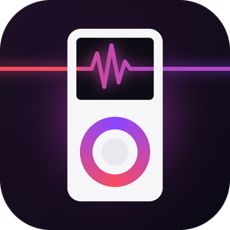
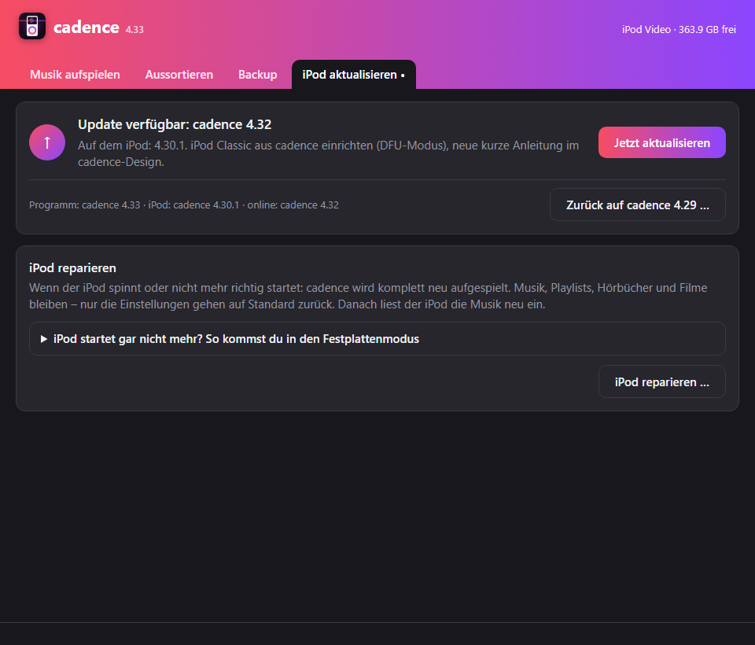
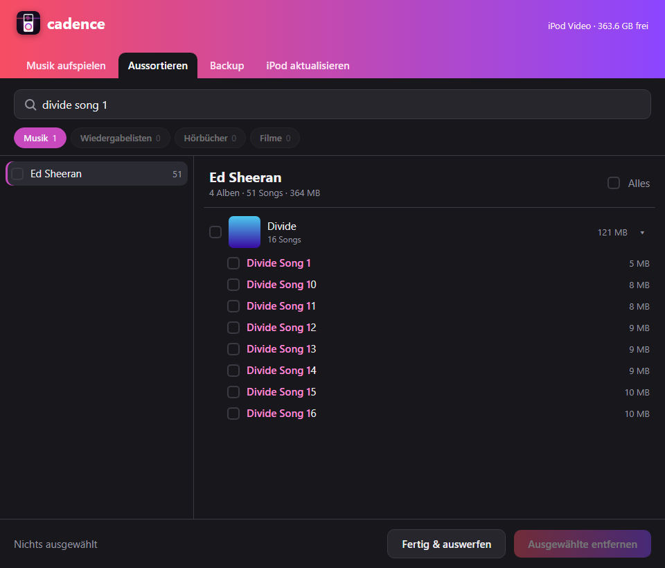
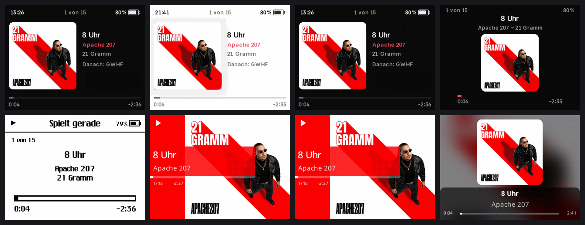

  

<h1 align="center">cadence</h1>

  <b>Dein iPod wie neu – Musik draufziehen, aussortieren, aktualisieren.</b> 
  Für den iPod Video (5. Generation) und den iPod Classic.

  <a href="https://github.com/StoreLiquid/cadence-download/releases/latest/download/cadence.dmg"><b>⬇ cadence für Mac herunterladen</b></a>

---

## So installierst du cadence (Mac)

1. **[cadence.dmg herunterladen](https://github.com/StoreLiquid/cadence-download/releases/latest/download/cadence.dmg)** und doppelklicken.
2. **cadence** auf den Ordner **Programme** ziehen. Fertig – das Fenster kannst du schließen.
3. cadence öffnen (Programme oder Spotlight: <kbd>⌘</kbd> + <kbd>Leertaste</kbd>, „cadence“).

> **Beim allerersten Öffnen** sagt der Mac: *„cadence kann nicht geöffnet werden …“*.
> Das ist normal (cadence ist nicht bei Apple angemeldet). So geht's weiter – **nur einmal nötig**:
> 1. Meldung mit **OK** schließen.
> 2. **Systemeinstellungen → Datenschutz & Sicherheit** öffnen und ganz nach unten scrollen.
> 3. Bei *„cadence wurde blockiert …“* auf **Dennoch öffnen** klicken und bestätigen.
>
> Danach öffnet sich cadence ganz normal.

Python oder sonst etwas musst du **nicht** installieren – alles ist dabei.

## iPod auf den neuesten Stand bringen

1. iPod mit dem Kabel anstecken und cadence öffnen.
2. Reiter **„iPod aktualisieren“** → steht dort **„Update verfügbar“**, auf **Jetzt aktualisieren** klicken.
3. Warten bis **„Fertig!“** kommt, dann den iPod abstecken. Er liest die Musik ein und startet von selbst neu.

cadence aktualisiert dabei auch sich selbst – du musst nie wieder etwas herunterladen.

## Was cadence kann

- **Musik aufspielen:** Alben, Songs, Playlists, Hörbücher und Filme einfach ins Fenster (oder aufs cadence-Symbol) ziehen.
  cadence sortiert alles richtig ein, findet Doppelte und macht die Cover passend.
- **Aussortieren:** Künstler links, Alben mit Cover rechts – anhaken, *Ausgewählte entfernen*, weg ist es.
- **Backup:** Musik vom iPod auf den Computer sichern (ab dem zweiten Mal nur das Neue).
- **iPod reparieren:** Spinnt der iPod, spielt cadence das System neu auf – deine Musik bleibt.
- **Neuen iPod einrichten:** Steckt ein iPod ohne cadence, erkennt cadence ihn und richtet ihn mit einem Klick ein.

## Am iPod

| Taste | Was passiert |
|---|---|
| **Play** (einschalten) | spielt direkt weiter, wo du aufgehört hast |
| **Menu** | eine Ebene zurück |
| **Menu lang** (bei „Spielt gerade“) | Helligkeit, Zufall, Wiederholen |
| **Musik → Einstellungen** | Themes, Equalizer, Einschlaf-Timer, *Abschalten in der Pause* (Aus / 5–60 Min.) |
| **Play halten** | ausschalten |
| **Menu + Select halten** | Neustart (wenn er mal hängt – der Musik passiert nichts) |

Verschiedene Looks zum Aussuchen unter *Musik → Einstellungen → Themes*:

## Wenn mal was nicht klappt

- **iPod startet gar nicht mehr?** Anstecken, **Menu + Select** halten bis der Apfel kommt, dann sofort
  **Select + Play** halten bis „Festplattenmodus“ erscheint. Dann in cadence: *iPod aktualisieren → iPod reparieren …*
- **Nach einem Update läuft etwas komisch?** In cadence: *iPod aktualisieren → Zurück auf …* holt den vorherigen Stand zurück.
- Während der iPod einliest: nichts drücken, nicht neu starten.

## Voraussetzungen

- Mac mit macOS 11 (Big Sur) oder neuer – Apple Silicon und Intel.
- iPod Video (5./5.5. Generation) oder iPod Classic (6./7. Generation).

---

cadence baut auf <a href="https://www.rockbox.org">Rockbox</a> auf (GNU GPL v2) – den Quellcode der Änderungen gibt es auf Anfrage.
Theme „Scrim“ nach PodBox „Scrim“ von Anthony Fletcher (CC BY-SA 3.0). Schriften: Noto Sans (SIL OFL), Material Design Icons (Apache 2.0).
